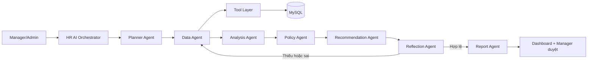

# Báo cáo TV3 - Agentic AI đánh giá năng lực

## 1. Phần việc của thành viên 3

Thành viên 3 phụ trách module hỗ trợ Manager đánh giá năng lực nhân viên bằng dữ liệu HRM:

- Thu thập task, review task, chấm công và nghỉ phép từ MySQL.
- Phân tích hiệu suất theo kỳ tháng.
- Tính điểm bằng công thức minh bạch.
- Đối chiếu kết quả với chính sách nhân sự.
- Sinh khuyến nghị có bằng chứng.
- Tự kiểm tra dữ liệu và kết quả trước khi lưu.
- Hỗ trợ Manager hỏi dữ liệu bằng ngôn ngữ tự nhiên.

Module không tự ra quyết định thay Manager. Kết quả là thông tin hỗ trợ; Manager vẫn phải duyệt hoặc từ chối.

## 1.1. Trạng thái dữ liệu trình diễn

Ngày 26/07/2026 đã gỡ toàn bộ cơ chế và dữ liệu tạo mẫu khỏi luồng TV3:

- Xóa `DemoDataSeeder` và endpoint `/api/test/seed-demo`.
- Xóa API chấm điểm giả `/api/manager/competency/{employeeId}/generate`.
- Xóa 50 bản ghi chấm công, 9 đơn chấm công và 18 ca làm có nhãn `[TEST]`.
- Xóa 4 review năng lực tháng 07/2026 được sinh từ bộ dữ liệu `[TEST]`.
- Giữ lại tài khoản, task, review và chấm công đã phát sinh qua nghiệp vụ thật.

Ca báo cáo hiện dùng task “Hoàn Thiện Báo cáo tháng 7”, review của Manager và các bản ghi chấm công đang có trong MySQL. Kết quả không được khai báo cố định ở frontend.

## 2. Bài toán cần giải quyết

Đánh giá nhân viên bằng cảm tính dễ thiếu nhất quán. Module TV3 kết hợp nhiều nguồn dữ liệu để trả lời ba câu hỏi:

1. Nhân viên đã làm được gì trong kỳ?
2. Kết quả có đủ bằng chứng và đúng chính sách không?
3. Manager nên ghi nhận, duy trì hay lập kế hoạch cải thiện?

## 3. Kiến trúc



## 4. Vì sao cần từng thành phần?

| Thành phần | Nhiệm vụ | Lý do tồn tại |
|---|---|---|
| Orchestrator | Điều phối toàn bộ workflow | Tránh frontend tự gọi rời rạc nhiều API và tránh bỏ sót bước kiểm tra |
| Planner Agent | Xác định dữ liệu, Tool và các bước cần chạy | Cho hệ thống biết phải làm gì trước khi phân tích |
| Data Agent | Thu thập dữ liệu theo đúng phạm vi quyền | Tách việc lấy dữ liệu khỏi việc chấm điểm |
| Tool Layer | Gọi Employee, Task, Attendance, Leave, Policy | Agent không được truy cập database tùy ý |
| Analysis Agent | Tính tín hiệu và điểm năng lực | Kết quả có thể kiểm tra lại bằng công thức |
| Policy Agent | Nạp quy định đang áp dụng | Khuyến nghị phải dựa trên chính sách, không dựa vào câu văn do LLM tự nghĩ |
| Recommendation Agent | Đề xuất hành động cho Manager | Biến điểm số thành hành động có lý do và bằng chứng |
| Reflection Agent | Kiểm tra dữ liệu, điểm, policy và khuyến nghị | Chặn kết quả thiếu bằng chứng hoặc tham chiếu policy sai |
| Report Agent | Chuẩn hóa kết quả cho dashboard | Frontend nhận một kết quả thống nhất, có trace để giải thích |
| Groq/LLM | Hiểu câu hỏi và diễn đạt tự nhiên | Không được tự sửa số liệu hoặc thay thế Scoring Engine |

## 5. Dữ liệu được lấy từ đâu?

| Nhóm dữ liệu | Bảng/nguồn | Dùng để làm gì? |
|---|---|---|
| Nhân viên | `employees`, `departments`, `positions` | Xác định nhân viên, phòng ban, chức vụ và phạm vi quản lý |
| Task | `tasks`, `task_progress_logs` | Tổng task, tiến độ, task hoàn thành, quá hạn |
| Review | `task_reviews` | Điểm chất lượng, deadline và quyết định của Manager |
| Chấm công | `attendance` | Ngày làm, đi muộn, về sớm, thiếu check-in/check-out |
| Nghỉ phép | `leave_requests` | Không đánh giá sai ngày nghỉ đã được duyệt |
| Chính sách | `Data/hr-policies.json` qua `PolicyTool` | Ngưỡng ghi nhận, phát triển, duy trì hoặc cải thiện |
| Kết quả | `competency_reviews` | Lưu kết quả hợp lệ để Manager duyệt |

Đây là dữ liệu truy vấn trực tiếp từ MySQL. Frontend không chứa danh sách điểm hoặc kết quả giả.

## 6. Điều kiện được phép chấm điểm

Hệ thống kiểm tra bốn nhóm bằng chứng:

- Có task trong kỳ: 35%.
- Có review chất lượng/deadline: 25%.
- Có chấm công hoặc nghỉ phép hợp lệ: 25%.
- Có lịch sử tiến độ hoặc trạng thái xử lý task: 15%.

Chỉ khi có task, review, chấm công và độ đầy đủ tối thiểu 85% thì `isDecisionReady=true`.

Nếu thiếu dữ liệu:

- Tổng điểm không được dùng để thưởng, phạt hoặc điều chỉnh lương.
- Recommendation phải dùng policy `DATA_REQUIRED`.
- Reflection trả trạng thái không hợp lệ hoặc có cảnh báo.
- Kết quả không được lưu vào `competency_reviews`.

## 7. Công thức điểm

### 7.1 Điểm chuyên cần

Điểm bắt đầu từ 100:

```text
AttendanceScore
= 100
- 4 x số ngày đi muộn
- 3 x số ngày về sớm
- 5 x số ngày thiếu check-in/check-out
+ điều chỉnh nghỉ phép được duyệt (tối đa 8 điểm)
```

### 7.2 Điểm hiệu suất task

```text
TaskPerformanceScore
= tiến độ trung bình x 35%
+ tỷ lệ task được duyệt x 45
+ tỷ lệ task đã gửi/được duyệt x 20
- 7 x task quá hạn
- 8 x task bị từ chối
```

### 7.3 Điểm chất lượng/kỹ năng

```text
QualitySkillScore
= điểm chất lượng x 75%
+ điểm deadline x 25%
- 4 x task cần sửa
- 8 x task bị từ chối
```

### 7.4 Điểm kỷ luật/trách nhiệm

Điểm dựa trên mức cập nhật tiến độ, task không cập nhật, task quá hạn và vấn đề chấm công.

### 7.5 Tổng điểm

```text
TotalScore
= AttendanceScore x 20%
+ TaskPerformanceScore x 40%
+ QualitySkillScore x 25%
+ DisciplineResponsibilityScore x 15%
```

Task chiếm trọng số cao nhất vì đây là bằng chứng trực tiếp về kết quả công việc. Chấm công chỉ chiếm 20% để tránh đánh đồng “có mặt nhiều” với “làm việc hiệu quả”.

## 8. Luồng hoạt động khi Manager bấm phân tích

1. Backend đọc `employee_id` và role từ JWT.
2. Manager chỉ được phân tích nhân viên thuộc phòng ban mình; Admin có phạm vi toàn hệ thống.
3. Planner tạo kế hoạch xử lý.
4. Data Agent gọi Tool Layer để lấy dữ liệu MySQL.
5. Analysis Agent kiểm tra độ đầy đủ rồi tính điểm.
6. Policy Agent nạp chính sách.
7. Recommendation Agent tạo hành động, lý do, bằng chứng và mã policy.
8. Reflection Agent kiểm tra:
   - Có đủ dữ liệu không?
   - Điểm có nằm trong 0-100 không?
   - Khuyến nghị có policy hợp lệ không?
   - Nhân viên thiếu dữ liệu có bị đề xuất thưởng/phạt sai không?
9. Nếu thiếu dữ liệu, Orchestrator thử thu thập lại tối đa hai vòng.
10. Nếu hợp lệ và `persistReview=true`, kết quả được lưu chờ Manager duyệt.
11. Report Agent trả dữ liệu cho dashboard và trace toàn bộ quá trình.

## 9. Kịch bản test trên giao diện

### Chuẩn bị

1. Chạy backend `http://localhost:5297`.
2. Chạy frontend `http://localhost:3000`.
3. Đăng nhập bằng tài khoản Admin hoặc Manager có dữ liệu thật.
4. Mở màn hình `Đánh giá năng lực` hoặc `Năng lực team`.
5. Chọn tháng có task đã được Manager review và có chấm công.

### Ca test chính hiện có

- Người thực hiện: Admin `ID 9`.
- Nhân viên: Phạm Thanh Sang `ID 6`.
- Kỳ: tháng 07/2026.
- Dữ liệu hiện tại: 1 task được duyệt, có review, 2 lần cập nhật tiến độ và 4 ngày chấm công.

### Các bước trình diễn

1. Chọn tháng `07/2026`.
2. Chọn Phạm Thanh Sang.
3. Bấm `Phân tích kỳ này`.
4. Mở popup chi tiết.
5. Chỉ vào:
   - Độ đầy đủ dữ liệu.
   - Bốn điểm thành phần.
   - Khuyến nghị và mã policy.
   - Reflection status.
   - Agent trace.
6. Đóng popup và mở review đã lưu.
7. Manager nhập ghi chú rồi duyệt hoặc từ chối.

Kết quả kiểm tra ngày 26/07/2026:

- `completionStatus = COMPLETED`.
- `isDecisionReady = true`.
- `dataCompletenessPercent = 100`.
- `totalScore = 87.24`.
- `reflection.validationStatus = VALID`.
- Recommendation dùng policy `GROWTH_85`.

Điểm có thể thay đổi khi task, review hoặc chấm công trong database thay đổi.

## 10. Test bằng Swagger

### Bước 1: đăng nhập

```http
POST /api/admin/auth/login
Content-Type: application/json

{
  "username": "<email Admin hoặc Manager>",
  "password": "<mật khẩu>"
}
```

Sao chép token, bấm `Authorize` trên Swagger và nhập:

```text
Bearer <token>
```

### Bước 2: chạy Agentic AI

```http
POST /api/manager/agentic-ai/analyze
Authorization: Bearer <token>
Content-Type: application/json

{
  "managerId": 0,
  "employeeId": 6,
  "month": 7,
  "year": 2026,
  "goal": "Đánh giá năng lực và đề xuất hành động cho quản lý",
  "persistReview": true
}
```

Backend bỏ qua `managerId` do client gửi và lấy ID thật từ JWT.

Kết quả kiểm tra quyền:

- Không có JWT: API trả `401 Unauthorized`.
- Admin `ID 9`: được phân tích nhân viên toàn hệ thống.
- Manager `ID 5`, phòng HR, thử phân tích nhân viên `ID 6`, phòng IT: API trả `400` và dừng workflow.
- API không trả dữ liệu rỗng như một lần chạy thành công khi nhân viên nằm ngoài phạm vi.

### Bước 3: kiểm tra các trường

- `managerId`: phải bằng ID trong JWT.
- `data.competencyInputs`: dữ liệu Tool đã lấy.
- `analysis.employees`: điểm và bằng chứng.
- `policy.source`: nguồn chính sách.
- `recommendation.items`: hành động, lý do và policy.
- `reflection.validationStatus`: kết quả tự kiểm tra.
- `persistedReviewIds`: review đã lưu.
- `trace`: lịch sử từng Agent.
- `llm.wasUsed`: Groq có thực sự được dùng trong request hay không.

### Bước 4: hỏi dữ liệu bằng ngôn ngữ tự nhiên

```http
POST /api/manager/agentic-ai/query
Authorization: Bearer <token>
Content-Type: application/json; charset=utf-8

{
  "managerId": 0,
  "question": "Phạm Thanh Sang đi trễ bao nhiêu ngày trong tháng 7?",
  "month": 7,
  "year": 2026
}
```

Kết quả kiểm tra ngày 26/07/2026:

- Orchestrator chọn `AttendanceTool` và metric `late_days`.
- Tool nhận đúng nhân viên Phạm Thanh Sang từ phạm vi JWT.
- Tool đọc 4 bản ghi chấm công và trả 4 ngày đi trễ kèm ngày, giờ vào và số phút trễ.
- Response Agent chỉ diễn đạt lại bằng chứng; không được tự đổi số.
- Lần kiểm tra cuối có `llm.wasUsed=true`, nghĩa là Groq đã diễn đạt phản hồi từ dữ liệu Tool.

Nếu gọi bằng Windows PowerShell 5, phải gửi body ở UTF-8 hoặc dùng trực tiếp Swagger. Nếu không, ký tự tiếng Việt có thể bị gửi sai:

```powershell
$utf8Body = [Text.Encoding]::UTF8.GetBytes(($body | ConvertTo-Json))
Invoke-RestMethod -ContentType "application/json; charset=utf-8" -Body $utf8Body
```

## 11. Groq hết quota thì sao?

Scoring Engine, Policy và Reflection vẫn chạy ổn định vì đây là nghiệp vụ cần tính xác định và có thể kiểm toán.

- Nếu Groq hoạt động: Planner, nhận xét và báo cáo được diễn đạt linh hoạt hơn; `llm.wasUsed=true`.
- Nếu Groq lỗi hoặc hết quota: hệ thống dùng kết quả xác định; `llm.wasUsed=false` và ghi rõ nguyên nhân.
- Không được báo cáo rằng Groq đã chạy nếu `llm.wasUsed=false`.

Thiết kế này giúp lỗi của dịch vụ AI bên ngoài không làm ngừng quy trình HRM và không cho LLM tự thay đổi số liệu.

## 12. Vì sao đây là Agentic AI, không phải chatbot?

Chatbot chủ yếu nhận câu hỏi và trả lời văn bản. Module này:

- Lập kế hoạch.
- Chọn và gọi Tool.
- Thu thập nhiều nguồn dữ liệu.
- Phân tích và áp dụng policy.
- Tự kiểm tra bằng Reflection.
- Có thể quay lại bước lấy dữ liệu hoặc tạo khuyến nghị.
- Lưu kết quả vào quy trình Manager duyệt.

Groq chỉ là một thành phần hỗ trợ ngôn ngữ. Orchestrator, Tool, Policy, Reflection và hành động nghiệp vụ mới tạo thành workflow Agentic AI.

## 13. Có áp dụng thực tế được không?

Có thể áp dụng như hệ thống hỗ trợ quyết định nếu doanh nghiệp:

- Cấu hình công thức và ngưỡng theo chính sách thật.
- Có dữ liệu task, review và chấm công đủ chất lượng.
- Phân quyền và lưu lịch sử thay đổi policy.
- Để Manager/HR phê duyệt quyết định cuối cùng.

Không nên dùng AI để tự động tăng lương, kỷ luật hoặc sa thải. Điểm số chỉ phản ánh dữ liệu hệ thống có; dữ liệu sai hoặc thiếu sẽ làm kết quả sai.

## 14. Hạn chế hiện tại

- Policy đang là JSON có version, chưa có màn hình HR quản trị hoặc RAG.
- Hỏi dữ liệu tự nhiên mới hỗ trợ đi trễ, lịch sử lương và tổng quan task.
- Chưa có kiểm tra thiên lệch theo giới tính, tuổi hoặc nhóm nhân sự.
- Chưa xuất báo cáo PDF/Excel trực tiếp từ Report Agent.
- Groq phụ thuộc quota của nhà cung cấp.
- Cần thêm bộ kiểm thử tự động cho công thức điểm và policy.

## 15. Câu hỏi thầy có thể hỏi

**Tại sao không để Groq tự chấm điểm?**  
Vì đánh giá nhân sự là nghiệp vụ nhạy cảm. Công thức xác định giúp giải thích, kiểm toán và không thay đổi ngẫu nhiên giữa hai lần chạy.

**AI có tự quyết định thưởng hoặc tăng lương không?**  
Không. AI chỉ đề xuất; Manager duyệt hoặc từ chối.

**Nếu thiếu chấm công thì sao?**  
Reflection đánh dấu thiếu dữ liệu, không cho dùng kết quả để ra quyết định và không lưu review hợp lệ.

**Nếu Groq hết quota thì còn gọi là Agentic AI không?**  
Workflow Agent, Tool, Policy và Reflection vẫn hoạt động. Tuy nhiên phải nói rõ request đó chạy ở chế độ xác định và `llm.wasUsed=false`.

**Tại sao Reflection chỉ lặp hai vòng?**  
Để tránh vòng lặp vô hạn, tăng thời gian phản hồi và phát sinh chi phí model. Nếu nguồn dữ liệu không thay đổi thì gọi lại nhiều lần cũng không tạo thêm bằng chứng.

**Có dùng được ngoài thực tế không?**  
Có, ở vai trò hỗ trợ quyết định. Muốn triển khai chính thức cần policy được HR phê duyệt, kiểm thử thiên lệch, audit log và quản trị dữ liệu.

## 16. Checklist trước khi báo cáo

- Backend và frontend đều chạy.
- Đăng nhập được tài khoản Admin/Manager.
- Swagger đã Authorize bằng JWT.
- Chọn đúng tháng `07/2026`.
- Kiểm tra nhân viên có task, review và chấm công.
- Kiểm tra endpoint status và quota Groq.
- Không nói Groq đã chạy nếu `llm.wasUsed=false`.
- Thử thêm một kỳ thiếu dữ liệu để chứng minh Reflection chặn kết quả.
- Không để API key hoặc mật khẩu database xuất hiện trên màn hình.
